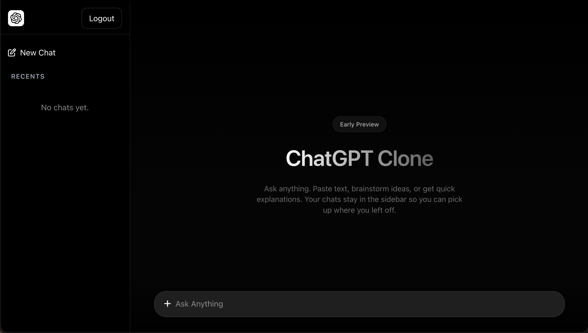
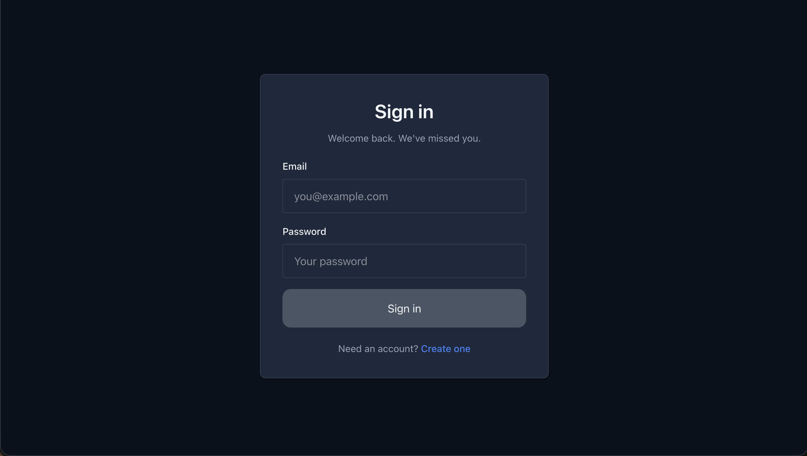
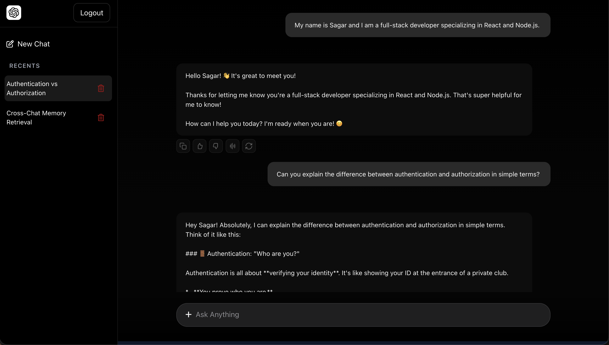
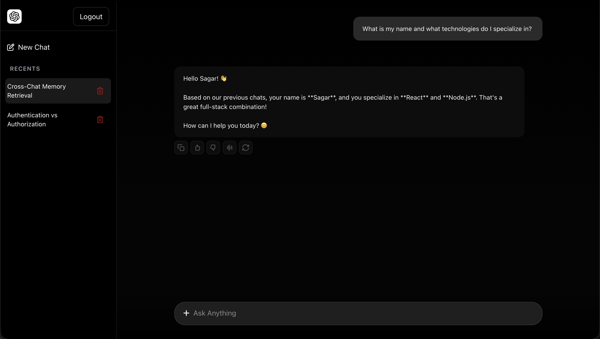

# ChatGPT Clone


## Overview

This project is a ChatGPT-like application that allows users to interact with an AI assistant in real time. It leverages Google's Gemini AI for generating responses and uses vector embeddings with Pinecone to support context-aware conversations.

The application follows a modern client-server architecture with a React frontend and a Node.js backend connected through Socket.IO.

> **Note:** This project was developed for educational and learning purposes.

---


## Live Demo

> This project is not publicly deployed due to the limited usage quota of free-tier AI services. To prevent quota exhaustion and ensure a consistent demonstration experience, screenshots and source code have been provided instead.

## Features

- User Authentication & Authorization
- Real-time AI Chat using Socket.IO
- AI-powered Responses using Google Gemini
- Context-aware Conversations using Vector Embeddings
- Persistent Chat History
- Fast and Responsive User Interface
- Protected Routes & Secure Sessions
- Responsive Design

---

## Tech Stack

### Frontend

- React.js
- Vite
- Redux Toolkit
- React Router DOM
- Axios
- Socket.IO Client
- Tailwind CSS

### Backend

- Node.js
- Express.js
- MongoDB
- Mongoose
- Socket.IO
- JWT Authentication
- Bcrypt.js

### AI & Vector Database

- Google Gemini API
- Gemini Embeddings
- Pinecone Vector Database

### Deployment

- Render

---

## Project Structure

```bash
ChatGPT-Clone/
│
├── client/             # Frontend application
│   ├── src/
│   ├── public/
│   └── ...
│
├── server/             # Backend application
│   ├── controllers/
│   ├── routes/
│   ├── models/
│   ├── middleware/
│   ├── services/
│   ├── sockets/
│   └── ...
│
└── README.md
```

---

## Application Flow

1. User signs up or logs in.
2. User sends a message from the chat interface.
3. Message is sent to the backend via Socket.IO/API.
4. Backend communicates with Google Gemini API.
5. Relevant context is retrieved and stored using Pinecone embeddings.
6. AI response is generated and returned to the client.
7. Chat history is stored in MongoDB.

---

## Learning Outcomes

This project helped me gain hands-on experience with:

- Full-Stack Application Development
- Authentication & Authorization
- Real-time Communication
- AI API Integration
- Vector Databases & Embeddings
- REST API Development
- State Management with Redux Toolkit
- Modern React Architecture
- Deployment on Render

---

## Screenshots

### Home Page



### Login Page



### Chat Interface



### Context-Awareness



## Author

**Sagar Dabhi**

- GitHub: https://github.com/SagarDabhi816
- LinkedIn: https://www.linkedin.com/in/sagar-dabhi-131a1626a?utm_source=share_via&utm_content=profile&utm_medium=member_android

---
